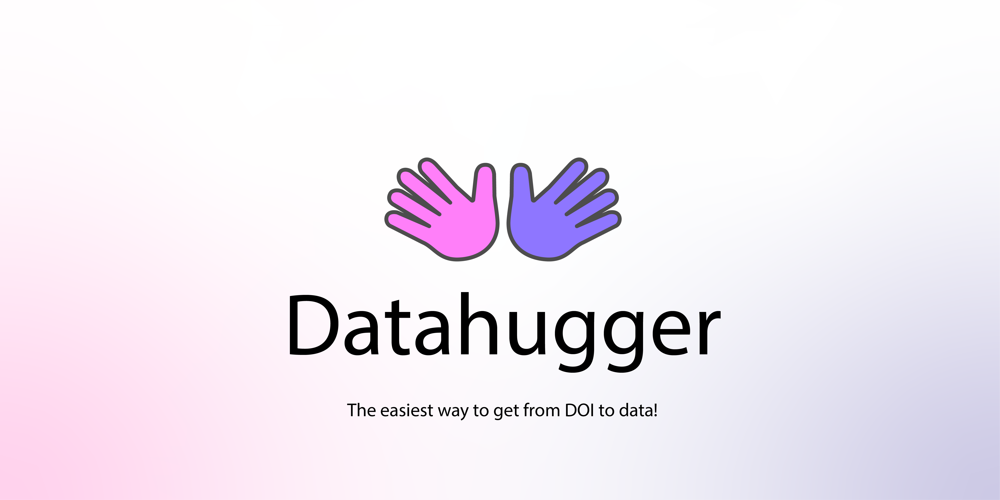

# Datahugger - Where DOI 👐 Data

Datahugger is a tool to download scientific datasets, software, and code from
a large number of repositories based on their DOI [(wiki)](https://en.wikipedia.org/wiki/Digital_object_identifier) or URL. With
Datahugger, you can automate the downloading of data and improve the
reproducibility of your research. Datahugger provides a straightforward
[Python interface](#download-with-python) as well as an intuitive
[Command Line Interface](#download-with-command-line) (CLI).

