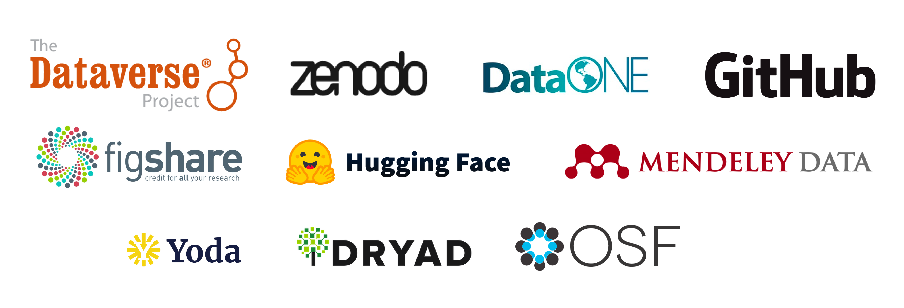

# Supported repositories

Datahugger offers support for more than <!-- count -->377<!-- count --> generic and specific (scientific) repositories (and more to come!).

We are still expanding Datahugger with support for more repositories. You can
help by [requesting support for a repository](https://github.com/J535D165/datahugger/issues/new/choose) in the issue tracker. Pull Requests are very
welcome as well.

The following list gives an (non-exclusive) overview of repositories supported
by Datahugger.

## Supported repositories

### Single implementations

- [zenodo](https://zenodo.org)
- [figshare](https://figshare.com)
- [GitHub](https://github.com)
- [DRYAD](https://datadryad.org)
- [Hugging Face](https://huggingface.co)
- [Open Science Framework (OSF)](https://osf.io)
- [Mendeley Data](https://data.mendeley.com)

### DataOne repositories

The following repositories (non exhaustive) make use of DataOne software.
DataOne software is supported by Datahugger.

- [Arctic Data Center](https://arcticdata.io)
- [Knowledge Network for Biocomplexity (KNB)](https://knb.ecoinformatics.org)
- [Pôle National de Données de Biodiversité Data Catalog](https://data.pndb.fr)
- [California Ocean Protection Council](https://opc.dataone.org)
- [portal.edirepository.org](https://portal.edirepository.org)
- [Gulf of Alaska Data Portal](https://goa.nceas.ucsb.edu)
- [Partnership for Interdisciplinary Studies of Coastal Oceans](https://data.piscoweb.org)
- [Atmospheric Radiation Measurement (ARM)](https://adc.arm.gov)
- [ScienceDB (Chinese Academy of Sciences)](https://scidb.cn)
- [ESS-DIVE](https://data.ess-dive.lbl.gov)
- [Hydroshare](https://hydroshare.org)
- [EarthChem](https://ecl.earthchem.org)
- [IEDA2](https://get.iedadata.org)
- [U.S. ANTARCTIC PROGRAM DATA CENTER](https://usap-dc.org)
- [International Year of the Salmon](https://iys.hakai.org)
- [PANGAEA](https://doi.pangaea.de)
- [Rolling Deck to Repository (R2R)](https://rvdata.us)
- [SEAD](https://sead-published.ncsa.illinois.edu)

### DataVerse repositories

See [https://dataverse.org/institutions](https://dataverse.org/institutions) and [DataVerse on Re3data.org](https://www.re3data.org/search?query=&software%5B%5D=DataVerse) for an overview of DataVerse repositories.
