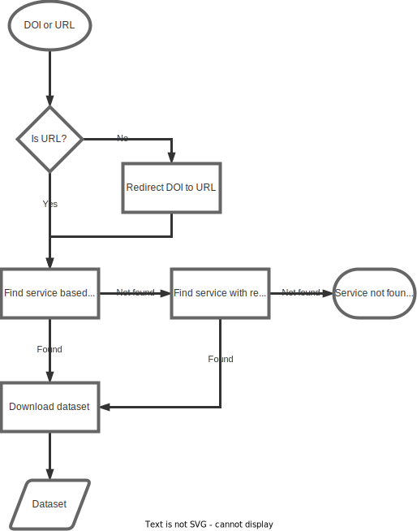

# How Datahugger works

## Architecture

Datahugger solves both a conceptual and technical issue. The main challenge
for datahugger is to connect the DOI to the machine-to-machine interface of
the repository (the API). For humans, it is often clear to click the download
button. However computers like to interact with the API. Unfortunately, there
is no metadata describing the API entry point and protocol. Datahugger tries
to solve this issue by creating this metadata or by doing an educated guess.
The following flowchart provides an overview of the working of datahugger.

  

## Interesting reads

The following articles and technical documents highlight relevant aspects of
the DOI to data issue.

- *Harvey MJ, Mason NJ, McLean A, Rzepa HS. Standards-based metadata procedures for retrieving data for display or mining utilizing persistent (data-DOI) identifiers. J Cheminform. 2015 Aug 8;7:37. doi: [10.1186/s13321-015-0081-7](https://doi.org/10.1186%2Fs13321-015-0081-7). PMID: 26257829; PMCID: PMC4528360.*
- *Sara Lafia & Werner Kuhn (2018) Spatial Discovery of Linked Research Datasets and Documents at a Spatially Enabled Research Library, Journal of Map & Geography Libraries, 14:1, 21-39, DOI: 10.1080/15420353.2018.1478923*
- [DOI Content Negotiation (Crosscite.org)](https://citation.crosscite.org/docs.html)
- Wass, Joe. “URLs and DOIs: A Complicated Relationship.” Crossref, [https://www.crossref.org/blog/urls-and-dois-a-complicated-relationship/](https://www.crossref.org/blog/urls-and-dois-a-complicated-relationship/).
